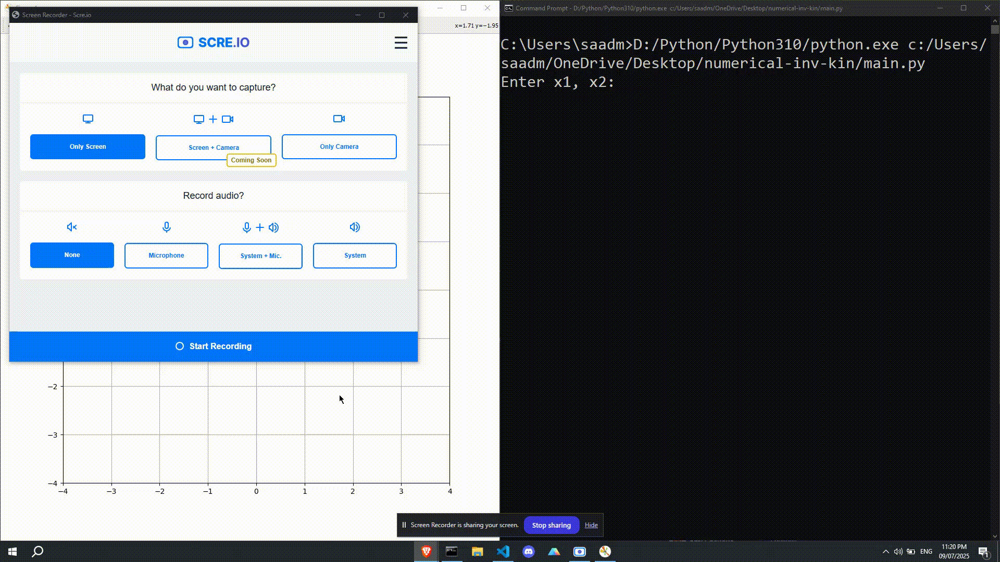

# 🦾 Numerical Inverse Kinematics Simulator

This project simulates a **3-DoF planar robotic arm** and uses a numerical inverse kinematics algorithm to move the arm to a desired target point (`x1`, `x2`) in 2D space. It visualizes the animation using `matplotlib` and performs inverse kinematics with `SymPy` and `NumPy`.

## 📽️ Demo



## 🧠 Features

- Inverse kinematics computation using Jacobian-based iterative optimization
- Smooth animation of the 3-joint robotic arm
- Interactive terminal-based input for target positions
- Real-time plotting with `matplotlib.animation`

## 📁 Project Structure

```    
numerical-inv-kin/
│
├── main.py                 # Main script that visualizes and animates the robot
├── inv\_kin\_calculate.py    # Numerical inverse kinematics calculation module
├── screen-capture.gif      # Demo GIF showing functionality
└── README.md               # Project documentation (this file)
```

## ⚙️ Requirements

Make sure you have the following Python packages installed:

```bash
pip install numpy matplotlib sympy
````

## 🚀 How to Run

1. Clone the repository or copy the files into a folder.
2. Open a terminal in that folder.
3. Run the main script:

   ```bash
   python main.py
   ```
4. Enter target coordinates (`x1`, `x2`) as prompted in the terminal.

## 🧮 Inverse Kinematics Method

The inverse kinematics uses the Jacobian matrix and a numerical optimization loop to solve for joint angles that will place the end-effector at the desired position. The calculation is implemented in `inv_kin_calculate.py` using SymPy's symbolic computation.

## ✍️ Author

**Saadman Sakib**
Contact: saadman.sakib2020@gmail.com

## 📜 License

This project is released under the MIT License.

